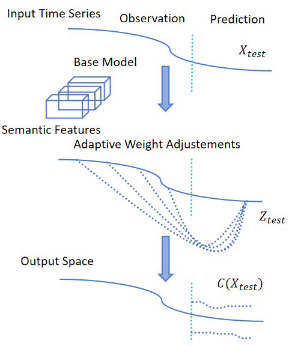

# CT-SSF code
Official implementation for Conformalized Time Series with Semantic Features (CT-SSF).



Our code leverages several related open-source resources from prior work, including [HopCPT](https://github.com/ml-jku/HopCPT) (Auer et al., 2023), [Feature CP](https://github.com/AlvinWen428/FeatureCP?tab=readme-ov-file) (Teng et al., 2022), [SPCI](https://github.com/hamrel-cxu/SPCI-code)  (Xu et al., 2023), [NexCP](https://projecteuclid.org/journals/annals-of-statistics/volume-51/issue-2/Conformal-prediction-beyond-exchangeability/10.1214/23-AOS2276.full) (Barber el al., 2022) and [auto_LiPRA](https://github.com/Verified-Intelligence/auto_LiRPA) (Xu et al., 2020). We thank the authors of these projects. For comprehensive information on these baselines, please refer to the respective sources.

Run the following command to install dependencies:
```
pip install -r requirements.txt
```

If you find our work useful, please consider citing it.


